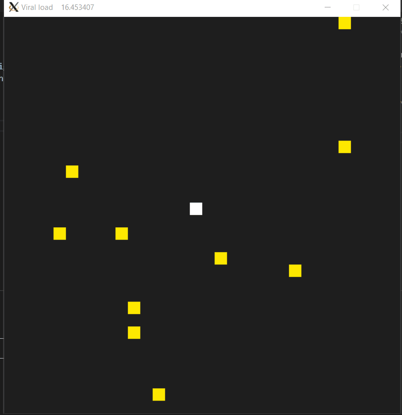

# Capstone Project Udacity C++ Nanodegree

Based in the Udacity Snake Game code but coded from zero, I implemented a pseudogame where you can move a character and see how the the effects of time and distance to a person in a room can change the viral load in its body.

This is an easy way to see how health recommendation could be visualized so a person could be aware of the importance of follow them.

## Project description

* The game is easy to play, you input the number of walkers you want to see in the screen, then you are the white pixel that can move up, down, left, right with the arrow keys and you should avoid the walkers that could be infected.

* While moving around the room, you can see the viral load incrementing, this acelerated when you are close to any other walker in the room, or you are near a group of walkers.

## Project structure

The game structure is almost the same as snake game:

1. Character: there are you kind of characters:
    * character: the main pixel moving
    * walker: a random computer managed random character that affects the player

2. Controller: this object controls all the inputs from the keyboard and change the character position

3. Renderer: Ojects that display the changes on the screen using the SDL2 library 

4. Game : implement all the game logic and the game loop

## Dependencies

* cmake >= 3.7
* make >= 4.1
* g++/gcc >= 5.4
* SDL2 >= 2.0
    * You can install using apt-get: 

        `sudo apt-get install libsdl2-dev`

## Building instructions

1. Clone this repository
2. `cd <project folder>`
3. `mkdir build`
4. `cd build`
5. `cmake ..`
6. `make`
7. `./PandemicRoom`

## Udacity Capstone Rubric Points adressed

### 1. README (All Rubric Points REQUIRED)

- [X] A README with instructions is included with the project
- [X] README indicates which project is chosen
- [X] The README includes information about each rubric point addressed

### 2. Compiling and Testing (All Rubric Points REQUIRED)

- [X] The submission must compile and run

### 3. Loops, Functions, I/O

- [X] The project demonstrates an understanding of C++ functions and control structures
- [ ] The project reads data from a file and process the data, or the program writes data to a file
- [X] The project accepts user input and processes the input
    * In the beginning it ask you for the number of walkers you would face in the simulation

### 4. Object Oriented Programming

- [X] The project uses Object Oriented Programming techniques
    * Game Renderer character are all objects
- [X] Classes use appropriate access specifiers for class members
- [X] Class constructors utilize member initialization lists
    * For example game sets the variables for width and height this way
- [X] Classes abstract implementation details from their interfaces
- [X] Classes encapsulate behavior
    * `Game::calculate_health()` or `Walker::Start_walking_thread()`
- [X] Classes follow an appropriate inheritance hierarchy
    * I used inheritance in the class `Walker` from `Character`
- [ ] Overloaded functions allow the same function to operate on different parameters
- [ ] Derived class functions override virtual base class functions
- [ ] Templates generalize functions in the project

### 5. Memory Management

- [X] The project makes use of references in function declarations
    * you could find that in `Controller::HandleInput`
- [X] The project uses destructors appropriately
    * I didnt really need this, but I delete the character when Game is destroyed, walkers are destroyed auto because they are smart pointers.
- [X] The project uses scope / Resource Acquisition Is Initialization (RAII) where appropriate
    * I used a vector of walkers `std::vector<   std::unique_ptr<Walker>   > walker_vector;` 
- [] The project follows the Rule of 5
    * I used smartpointers for movable objects
- [X] The project uses move semantics to move data, instead of copying it, where possible
    * I used std::move for emplacing threads, they are only movable
- [X] the project uses smart pointers instead of raw pointers
    * The project used both of them.
  

### 6. Concurrency

* The project uses multithreading
- [X]I used non efficient way but for the sake of it I wanted to play, so I implemented one thread in every walker that chanes randomly the movement `character.cpp:67`
- [ ] A promise and future is used in the project
- [ ] A mutex or lock is used in the project
  * No.
- [ ]A condition variable is used in the project
  * No.

